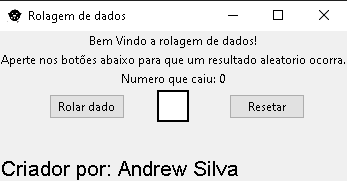

<h1>PROJETO COM TKINTER</h1>

Nesse projeto o objetivo foi a tentativa do uso da orientação de objetos e uma tentativa de fazer uma rolagem de dados com imagem

Objetivos futuros: Estilizar app e adicionar mais opções

